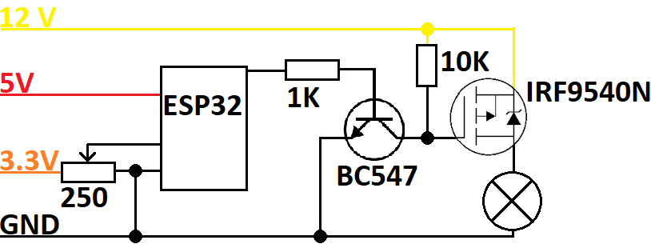

# CarLightControl
Control and dim (dismounted) carlights with an ESP32 webserver, or via potentiometer.

A friend of mine asked me for a small project to control old taillights from his car. Me, happy that i can solder and program again and willing to help, started doing it. Here it is.

## What's in the code
The code controls 5 lights of one backlight of a car:
* Blinker
* Reverse light
* Brake light
* Running light

Each light is individually dimmable. Blinker is able blink (you don't say).

# Circuit
See  [this diagram](#Simplified) for a simplified circuit. I also made a more professional one with EasyEDA which could be ordered there for a few bugs.

## Easy-EDA
Follow link to [OSHWLab](https://oshwlab.com/frostfreak/carlightcontrol):

## Simplified
Following diagram (nice paint skills, eh?) shows a simplified circuit how every bulb (in this case only one) is connected to the ESP32.

* **12 V**: Power Source for dimming/switching/blinking lamps
* **5 V**: Power Source for ESP32 (depends on your development kit!)
* **3.3 V**: Maximum voltage for ESP32 Input from potentiometer
* **IRF9540N**: P-Channel Mosfet to control each bulb
* **BC547**: NPN-Transistor to toggle IRF9540N
* **250 Ohms potentiometer**: for measuring voltage input
* **1K Ohms resistor**: On ESP32 for safeguarding and current limiting
* **10K Ohms resistor**: Pull up resistor

Note: I take no guarantee on correctness. I am a programmer, not an electronics engineer ;)